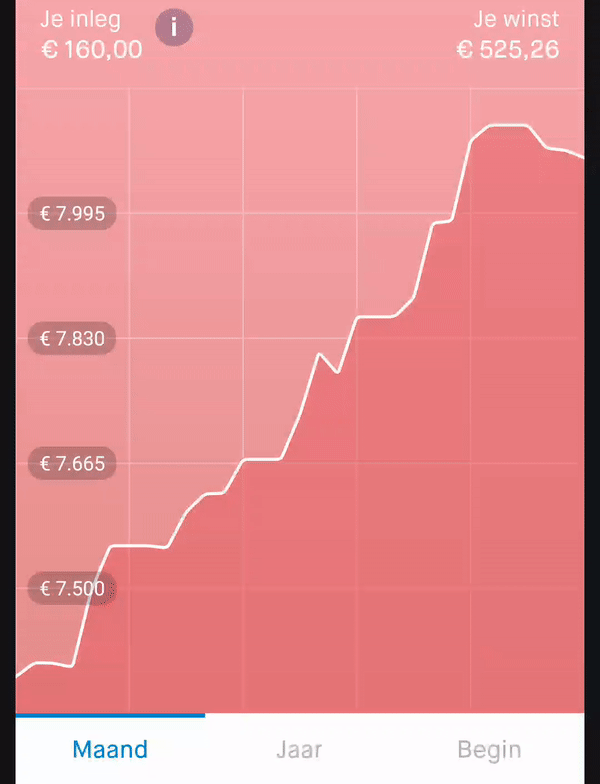

# line-chart [](https://jitpack.io/#davidmigloz/line-chart)

A simple Android line chart library.



## Usage

#### Step 1

Add the JitPack repository to your `build.gradle` file:

```gradle
allprojects {
	repositories {
		...
		maven { url "https://jitpack.io" }
	}
}
```

#### Step 2

Add the dependency:

```gradle
dependencies {
	implementation 'com.github.davidmigloz:line-chart:1.0.0'
}
```

[CHANGELOG](https://github.com/davidmigloz/line-chart/blob/master/CHANGELOG.md)

#### Step 3

Use `LineChartView` in your layout:

```xml
<com.davidmiguel.linechart.LineChartView
    android:id="@+id/lineChart"
    android:layout_width="match_parent"
    android:layout_height="0dp"
    app:linechart_gridXDivisions="5"
    app:linechart_gridYDivisions="5"
    chart:linechart_fillColor="#80d84e62"
    chart:linechart_lineColor="@color/white"
    chart:linechart_scrubEnabled="true" />
```

#### XML attributes

Take a look to [`attrs.xml`](https://github.com/davidmigloz/line-chart/blob/master/linechart/src/main/res/values/attrs.xml).

#### Methods

Take a look to [`LineChart.java`](https://github.com/davidmigloz/line-chart/blob/master/linechart/src/main/java/com/davidmiguel/linechart/LineChart.kt).

#### Callback

If you want to listen to scrub events, you can use `OnScrubListener`:

```java
lineChart.scrubListener = OnScrubListener { value: Any? ->
    ...
}
```

Take a look at the [sample app](https://github.com/davidmigloz/line-chart/tree/master/sample) to see the library working.

## Contributing

If you find any issues or you have any questions, ideas... feel free to [open an issue](https://github.com/davidmigloz/line-chart/issues/new).
Pull request are very appreciated.

## License

Copyright (c) 2021 David Miguel Lozano

Licensed under the Apache License, Version 2.0 (the "License");
you may not use this file except in compliance with the License.
You may obtain a copy of the License at

http://www.apache.org/licenses/LICENSE-2.0

Unless required by applicable law or agreed to in writing, software
distributed under the License is distributed on an "AS IS" BASIS,
WITHOUT WARRANTIES OR CONDITIONS OF ANY KIND, either express or implied.
See the License for the specific language governing permissions and
limitations under the License.
